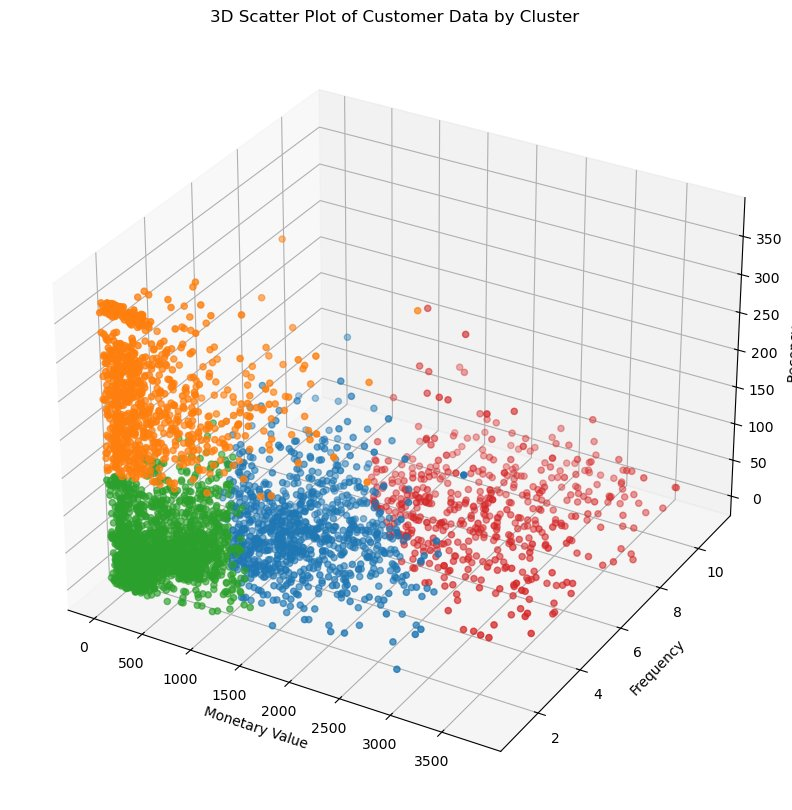

# 🛒 Retail Customer Behavior Analysis using KMeans Clustering


---

## 📌 Overview

This project applies **unsupervised machine learning** — specifically KMeans Clustering — to segment retail customers based on their transactional behaviors. By leveraging the **RFM (Recency, Frequency, Monetary Value)** framework, customers are grouped into meaningful segments that enable targeted marketing strategies, personalized engagement, and data-driven business decisions.

The end result is a set of actionable customer clusters — each with a descriptive business label — that a retail company can immediately operationalize across its marketing and customer success functions.

---

## 💼 Business Problem

Retail businesses often treat all customers the same, applying blanket promotions and generic communication strategies regardless of how valuable or engaged each customer actually is. This leads to:

- Wasted marketing spend on unresponsive customers
- Missed opportunities to retain or reward high-value customers
- Inability to identify at-risk customers before they churn
- Low conversion rates from generic campaigns

Without a structured understanding of customer behavior, it becomes nearly impossible to allocate resources efficiently or personalize the customer experience at scale.

---

## 🎯 Business Objective

The primary objective is to **segment the customer base into distinct behavioral groups** using transaction history, enabling the business to:

- Identify and reward the most loyal and high-spending customers
- Re-engage dormant or low-frequency customers before they churn
- Nurture newer or lower-value customers to increase their lifetime value
- Tailor marketing campaigns, promotions, and communication strategies to each segment
- Prioritize resources toward the most impactful customer groups

---

## 📦 Dataset

### Source

| Detail | Info |
|---|---|
| **Name** | Online Retail II |
| **Source** | [UCI Machine Learning Repository](https://archive.ics.uci.edu/dataset/502/online+retail+ii) |
| **Format** | Excel (.xlsx) |
| **Coverage** | UK-based online retail gift-ware store |
| **Customer Type** | Mix of retail consumers and wholesale buyers |

### Dataset Summary

| Field | Description |
|---|---|
| `Invoice` | 6-digit transaction number (prefix `C` = cancellation; prefix `A` = bad debt) |
| `StockCode` | 5-digit product identifier (may include alphanumeric suffixes) |
| `Description` | Product name |
| `Quantity` | Units purchased per transaction (negatives = returns/cancellations) |
| `InvoiceDate` | Date and time of the transaction |
| `Price` | Unit price in GBP (£) |
| `Customer ID` | Unique 5-digit customer identifier |
| `Country` | Country of the customer |

### Dataset Challenges

- **Missing Customer IDs** — A significant portion of records had no customer identifier, making it impossible to attribute transactions to individual customers. These rows were excluded.
- **Negative Quantities** — Returns and cancellations were represented by negative quantity values. Invoices starting with `C` (cancellations) were filtered out entirely.
- **Invalid/Special Stock Codes** — Non-standard stock codes such as `POST`, `DOT`, `AMAZONFEE`, `BANK CHARGES`, `TEST`, `D`, `M`, `S`, `C2`, and `C3` represented administrative entries rather than real products and were removed. `PADS` was retained as a legitimate product code.
- **Zero-Price Items** — Items with a unit price of £0.00 were excluded to avoid distorting the monetary calculations.
- **Bad Debt Invoices** — Invoices prefixed with `A` represented bad debt adjustments and were excluded.
- **Trailing Whitespace in Stock Codes** — One stock code (`47503J `) had a trailing space and was cleaned to `47503J`.
- **Data Loss** — After all cleaning steps, approximately **27% of the original records were removed**, preserving the integrity of the remaining dataset.

---

## 🛠️ Tech Stack

| Category | Tools / Libraries |
|---|---|
| **Language** | Python 3.8+ |
| **Data Manipulation** | Pandas, NumPy |
| **Visualization** | Matplotlib, Seaborn |
| **Machine Learning** | Scikit-Learn (KMeans, StandardScaler, Silhouette Score) |
| **Development Environment** | Jupyter Notebook |
| **Data Source Format** | Microsoft Excel (.xlsx) |

---

## 🔄 Project Workflow

```
1. Data Collection & Loading
         ↓
2. Data Exploration
         ↓
3. Data Wrangling & Cleaning
         ↓
4. Exploratory Data Analysis (EDA)
         ↓
5. Feature Engineering (RFM Metrics)
         ↓
6. Outlier Detection & Treatment
         ↓
7. Feature Scaling (StandardScaler)
         ↓
8. Optimal K Selection (Elbow + Silhouette)
         ↓
9. KMeans Model Training
         ↓
10. Cluster Labeling & Outlier Segmentation
         ↓
11. Business Interpretation & Visualization
```

---

## 📊 Exploratory Data Analysis

EDA was conducted both at the raw transaction level and after aggregating to RFM features:

**Transaction-Level Exploration:**
- Verified invoice formats and filtered cancellations (`C` prefix) and bad debt (`A` prefix)
- Audited all unique stock code patterns to identify and remove non-product entries
- Confirmed that `Customer ID` data type needed conversion and handled missing values

**RFM Distribution Analysis:**
- **Monetary Value** — Right-skewed distribution, with a small number of customers driving disproportionately high revenue
- **Frequency** — Majority of customers made only a handful of purchases, with a long tail of highly frequent buyers
- **Recency** — Most customers had purchased recently, though a notable segment had been inactive for extended periods

**Outlier Analysis:**
- IQR-based outlier detection was applied separately to Monetary Value and Frequency
- Outliers were not discarded — they were preserved and segmented independently as premium/high-value groups
- The main KMeans model was trained on the non-outlier population to avoid distortion

**3D Scatter Visualization:**
- Pre- and post-scaling 3D scatter plots of the three RFM dimensions were used to visually confirm cluster separability after standardization

---

## 🤖 Machine Learning Models

### Algorithm: KMeans Clustering

KMeans was selected for this project due to its:
- Efficiency on medium-to-large tabular datasets
- Interpretability of centroids for business storytelling
- Suitability for RFM-based customer segmentation problems

**Preprocessing:**
- RFM features were computed by aggregating cleaned transaction data at the customer level
- `Sales = Quantity × Price` was engineered as the monetary basis
- `Recency` was computed as the number of days since each customer's last invoice, relative to the dataset's latest date
- Features were standardized using `StandardScaler` to ensure equal weighting in distance calculations

**Optimal K Selection:**

Two complementary methods were used to identify the best number of clusters:

| Method | Description |
|---|---|
| **Elbow Method** | Plots inertia (within-cluster sum of squares) vs. k — the "elbow" indicates diminishing returns |
| **Silhouette Score** | Measures cohesion vs. separation — higher scores indicate better-defined clusters |

Both methods converged on **k = 4** as the optimal number of clusters for the main (non-outlier) customer population.

---

## 📈 Model Performance Comparison

| k (Clusters) | Inertia | Silhouette Score |
|:---:|---|---|
| 2 | High | Moderate |
| 3 | Moderate | Moderate-High |
| **4** | **Optimal Elbow Point** | **Highest Score** |
| 5 | Lower | Begins to Decline |
| 6–12 | Continues Decreasing | Further Decline |

Both the Elbow chart and Silhouette score analysis aligned at **k = 4**, confirming this as the most statistically meaningful and interpretable segmentation.

---

## 🏆 Best Model Analysis

The final model used **KMeans with k = 4** (`random_state=42`, `max_iter=1000`) applied to StandardScaler-transformed RFM features.



**Cluster Characteristics (Main Population):**

| Cluster | Color | Label | Monetary Value | Frequency | Recency | Interpretation |
|:---:|---|---|---|---|---|---|
| 0 | 🔵 Blue | **RETAIN** | High | Moderate-High | Moderate | Loyal, high-value customers who purchase regularly but not always recently |
| 1 | 🟠 Orange | **RE-ENGAGE** | Low | Low | High (Inactive) | Low-value, infrequent buyers who have not purchased recently |
| 2 | 🟢 Green | **NURTURE** | Low-Moderate | Low | Low (Recent) | Newer or casual customers with recent activity but low engagement depth |
| 3 | 🔴 Red | **REWARD** | Highest | Highest | Low (Very Active) | Best customers — highest spend, most frequent, still actively purchasing |

**Outlier Clusters (Extreme Segments):**

| Cluster | Label | Description |
|:---:|---|---|
| -1 | **PAMPER** | Monetary-only outliers — extremely high spenders with normal purchase frequency |
| -2 | **UPSELL** | Frequency-only outliers — very frequent buyers who may not yet be high spenders |
| -3 | **DELIGHT** | Both monetary and frequency outliers — ultra-premium, VIP customers |

---

## 💡 Key Findings

- The customer base naturally segments into **four core behavioral clusters** plus **three premium outlier groups** — seven distinct customer personas in total
- The **REWARD** segment (Cluster 3) represents the most valuable customers: highest monetary value, highest purchase frequency, and most recent activity. These are the VIPs who drive a disproportionate share of revenue
- The **RE-ENGAGE** segment (Cluster 1) contains a large number of dormant customers — a significant revenue recovery opportunity if re-activation campaigns are launched
- The **NURTURE** segment (Cluster 2) consists of recent but shallow buyers, suggesting they may be new customers who could be converted into loyal regulars with the right onboarding approach
- The **RETAIN** segment (Cluster 0) contains high-value regulars who are not as active as REWARD customers — retention programs can prevent them from drifting toward the RE-ENGAGE group
- The **DELIGHT** outlier group (Cluster -3) represents ultra-premium customers who combine both extreme spending and extreme frequency — a small but critically important VIP cohort
- Roughly **27% of the original transaction records** were removed during cleaning, underscoring the importance of data quality in deriving reliable customer insights

---

## 📣 Business Impact

| Customer Segment | Recommended Strategy | Expected Impact |
|---|---|---|
| **REWARD** | Loyalty programs, VIP perks, early access to new products | Maximize retention of top revenue drivers |
| **RETAIN** | Personalized outreach, exclusive discounts, milestone rewards | Prevent churn; increase purchase frequency |
| **RE-ENGAGE** | Win-back email campaigns, time-limited offers, surveys | Recover lost revenue from dormant customers |
| **NURTURE** | Welcome series, product discovery nudges, onboarding incentives | Convert new/casual buyers into loyal customers |
| **PAMPER** | White-glove service, premium bundles, account managers | Protect and grow relationships with high spenders |
| **UPSELL** | Cross-sell campaigns, volume discounts, subscription offers | Increase average order value for frequent buyers |
| **DELIGHT** | Bespoke experiences, co-creation invitations, top-tier loyalty tier | Retain and celebrate the most valuable VIP relationships |

By targeting each segment with tailored strategies, the business can increase marketing ROI, reduce churn, and significantly improve customer lifetime value across its entire base.

---

## 📁 Repository Structure

```
retail-customer-clustering/
│
├── Retail_Customers_Behaviors_using_KMeans_Clustering.ipynb   # Main analysis notebook
├── online_retail_II.xlsx                                       # Raw dataset (not included — see UCI link)
└── README.md                                                   # Project documentation
```

---

## 👩‍💻 Author

**Reemika Subrata Das**

[](https://linkedin.com/in/reemikadas)
[](https://github.com/reemikadas)
[](mailto:das.reemika@gmail.com)
---


*If you found this project useful, please consider giving it a ⭐ on GitHub!*
